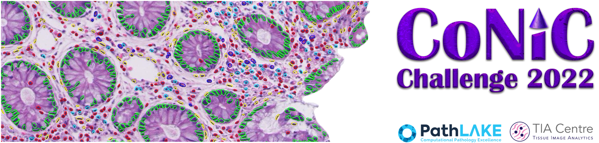

<p align="center">
  
</p>

# CoNIC: Colon Nuclei Identification and Counting Challenge

In this repository we provide code and example notebooks to assist participants start their algorithm development for the CoNIC challenge. In particular we provide:

- Evaluation code
  - Segmentation & classification: multi-class panoptic quality (mPQ<sup>+</sup>)
  - Predicting cellular composition: multi-class coefficient of determination (R<sup>2</sup>)

- Example notebooks
  - Data reading and simple dataset statistics
  - HoVer-Net baseline inference

**NEWS: We have now released the training code that we used to train the baseline method (HoVer-Net). For this, we created a new branch, named `conic` in the original HoVer-Net repository. Click on [this link](https://github.com/vqdang/hover_net/tree/conic) to access the code!**

## Output format for metric calculation

To appropriately calculate the metrics, ensure that your output is in the following format:

- Instance Segmentation and classification map:
    - `.npy` array of size Nx256x256x2, where N is the number of processed patches.
    - First channel is the instance segmentation map containing values ranging from 0 (background) to n (number of nuclei).
    - Second channel is the classification map containing values ranging from 0 (background) to 6 (number of classes in the dataset).
  
- Composition prediction:
  - Single `.csv` file where the column headers should be:
    - `neutrophil`
    - `epithelial`
    - `lymphocyte`
    - `plasma`
    - `eosinophil`
    - `connective`
  - To make sure the calculation is done correctly, ensure that the row ordering is the same for both the ground truth and prediction csv files.

## Metric calculation
  To get the stats for segmentation and classification, run:

  ```
  python compute_stats.py --mode="seg_class" --pred=<path_to_results> --true=<path_to_ground_truth>
  ```
  
  To get the stats for cellular composition prediction, run:

  ```
  python compute_stats.py --mode="regression" --pred=<path_to_results> --true=<path_to_ground_truth>
  ```

## Cite

If you are comparing against any of the methods within the challenge or using this repository or using our dataset, you must cite:

- Graham, Simon, et al. "CoNIC Challenge: Pushing the frontiers of nuclear detection, segmentation, classification and counting." Medical image analysis 92 (2024): 103047.
```latex
@article{graham2024conic,
  title={CoNIC Challenge: Pushing the frontiers of nuclear detection, segmentation, classification and counting},
  author={Graham, Simon and Vu, Quoc Dang and Jahanifar, Mostafa and Weigert, Martin and Schmidt, Uwe and Zhang, Wenhua and Zhang, Jun and Yang, Sen and Xiang, Jinxi and Wang, Xiyue and others},
  journal={Medical image analysis},
  volume={92},
  pages={103047},
  year={2024},
  publisher={Elsevier}
}
```

- Graham, Simon, et al. "Lizard: A Large-Scale Dataset for Colonic Nuclear Instance Segmentation and Classification." Proceedings of the IEEE/CVF International Conference on Computer Vision. 2021.
```
@inproceedings{graham2021lizard,
  title={Lizard: a large-scale dataset for colonic nuclear instance segmentation and classification},
  author={Graham, Simon and Jahanifar, Mostafa and Azam, Ayesha and Nimir, Mohammed and Tsang, Yee-Wah and Dodd, Katherine and Hero, Emily and Sahota, Harvir and Tank, Atisha and Benes, Ksenija and others},
  booktitle={Proceedings of the IEEE/CVF International Conference on Computer Vision},
  pages={684--693},
  year={2021}
}
```
